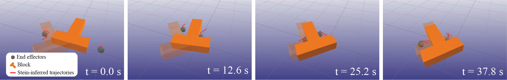
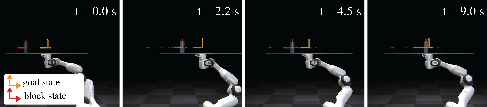

# Stein Variational Distributionally Robust Planning for Contact-Rich Manipulation

Reference implementation for **"[Distributionally Robust Control via Stein
Variational Inference for Contact-rich Manipulation](https://arxiv.org/pdf/2605.19029)"** (Robotics: Science and
Systems, 2026).

<p align="center">
  
  <br>
  <em>Bimanual T-block pushing. Two end effectors reorient the block toward its goal pose; red curves show the Stein-inferred trajectories that adapt to parameter uncertainty.</em>
</p>

<p align="center">
  
  <br>
  <em>Dynamic waiter. A Franka arm balances and transports a block to its goal under uncertain block inertia, mass, and friction. [See hardware demo of continuous 3 minute run under real world parameter uncertainty!](https://drive.google.com/file/d/1vDYLHdLCSiGETdw9enmKbJArOOkpnLoM/view)</em>
</p>


(Abstract): Reliable robotic manipulation requires control policies that can 
accurately represent and adapt to uncertainty arising from contact-rich 
interactions. Modern data-driven methods mitigate uncertainty through 
large-scale training and computation, and degrade significantly in performance 
with limited number of training samples. 
By contrast, classical model-based controllers are computationally efficient 
and reliable, but their limited ability to represent task-relevant uncertainty 
can hinder performance in contact-rich interactions. 

In this work, we propose to expand the capabilities of model-based manipulation 
control through more flexible uncertainty modeling that retains performance 
while exactly adapting to uncertainty. 
Our approach casts the manipulation problem as a distributionally robust control 
optimization and proposes a novel deterministic formulation based on Stein 
variational inference that preserves performance while explicitly modeling 
task-sensitive parameter uncertainty. 
As a result, the derived controllers are more aware of task sensitivities to 
uncertainty, yielding high reliability without compromising performance.
Experimental results demonstrate up to 3$\times$ improved robustness across a 
range of contact-rich manipulation tasks under broad parametric uncertainty, 
outperforming existing model-based control methods.

---

## Table of contents

- [What the code does](#what-the-code-does)
- [Installation](#installation)
- [Quick start](#quick-start)
- [Command-line interface](#command-line-interface)
- [Repository layout](#repository-layout)
- [The four planners](#the-four-planners)
- [The two experiment backends](#the-two-experiment-backends)
- [Outputs on disk](#outputs-on-disk)
- [Rendering](#rendering)
- [Extending the code](#extending-the-code)
- [Reproducing the paper](#reproducing-the-paper)
- [Troubleshooting](#troubleshooting)
- [Citation](#citation)

---

## What the code does

Each **trial** runs a closed-loop planning experiment for one method on one
task:

1. **Initialize** a particle ensemble over the uncertain physical parameters
   by sampling uniformly from prior box bounds.
2. **Plan and execute** in a receding-horizon loop. At every replanning cycle,
   a predictive sampler ([predictive sampling](https://arxiv.org/abs/2212.00541))
   draws candidate control splines, rolls each one out under the surrogate
   contact dynamics for every particle, scores them with the method's cost
   function, executes the best, and records the realized state/contact forces.
3. **Update the belief.** SVDRO transports the particles with SVGD; the
   baselines either resample from the prior or hold a fixed mean estimate.
4. **Save** the trajectory, control splines, losses, and parameter history to
   disk, then (optionally) **render** an MP4 of the executed trajectory.

The main entry point sweeps this over `num_trials` random seeds and over all
four methods for the chosen task.

---

## Installation

The code targets **Python 3.11+** and uses [JAX](https://github.com/google/jax)
for the dynamics, autodiff, and SVGD.

```bash
# clone
git clone <your-repo-url> stein-dro
cd stein-dro

# create an environment (conda shown; venv works too)
conda create -n stein-dro python=3.11 -y
conda activate stein-dro
```

**Core dependencies (training):**

```bash
pip install "jax[cpu]" numpy dill tqdm click mujoco imageio imageio-ffmpeg
```

For GPU acceleration, install the CUDA build of JAX instead of `jax[cpu]`
following the [official JAX install guide](https://github.com/google/jax#installation).

**Rendering dependencies (optional):**

```bash
pip install mujoco imageio imageio-ffmpeg
```

The **dynamic-waiter renderer additionally requires the Franka Panda model**
from [MuJoCo Menagerie](https://github.com/google-deepmind/mujoco_menagerie).
Place it one directory *above* the repository root so the relative path
`../mujoco_menagerie/franka_emika_panda/panda_nohand.xml` resolves:

```
parent/
├── mujoco_menagerie/          # git clone https://github.com/google-deepmind/mujoco_menagerie
│   └── franka_emika_panda/
└── stein-dro/                 # this repository
```

The bimanual renderer needs no external assets.

If you only want to run experiments without video, you can skip the rendering
dependencies entirely and always pass `--no-render`.

---

## Quick start

```bash
### Examples
# Run the dynamic-waiter task for all four methods, 32 trials each, with rendering
python main.py --experiment_name waiter

# Run the bimanual task without rendering (no MuJoCo needed), 8 trials.
python main.py --experiment_name bimanual --num_trials 8 --no-render
```

Run `main.py` **from the repository root** — output paths (`data/`, `videos/`)
and the renderer's asset path are resolved relative to the current working
directory.

---

## Command-line interface

```
python main.py [OPTIONS]

  --experiment_name [waiter|bimanual]   Experiment backend to run.  [default: waiter]
  --num_trials INTEGER                  Number of trials (seeds) per method.  [default: 32]
  --render / --no-render                Render an MP4 after each trial (requires MuJoCo).  [default: render]
  --render_verbose                      Print per-trial render progress.  [default: off]
  --help                                Show this message and exit.
```

Notes:

- `--no-render` skips video generation, so **MuJoCo is not imported at all** —
  useful for headless training on machines without a GPU/GL stack.
- `--render_verbose` surfaces the renderer's frame-by-frame progress; by
  default only the output path of each finished video is printed.

---

## Repository layout

```
main.py                              Entry point: sweep methods × trials, save, render.
_file_utils/
├── make_paths.py                    data/<backend>/pkl and videos/<backend>/mp4 path helpers.
└── check_file_exists.py             Skip-if-already-done bookkeeping.
config/
├── methods.py                       make_methods(backend) -> (SVDRO, EMPPI, MPC, DRO).
├── logger.py                        Backend-agnostic trajectory/loss/param logging + saving.
├── predictive_sampler.py            Predictive-sampling action selection (shared).
├── trajsplines.py                   Post-hoc per-particle trajectory-spline generation.
├── solver/
│   └── svgd.py                      Stein Variational Gradient Descent solver.
├── config_waiter/
│   ├── config_experiment.py         Dynamic-waiter costs, bounds, priors, belief utilities.
│   └── sim.py                       Dynamic-waiter contact dynamics + surrogate model.
└── config_bimanual/
    ├── config_experiment.py         Bimanual costs, bounds, priors, belief utilities.
    └── sim.py                       Bimanual T-block contact dynamics + surrogate model.
render/
├── __init__.py                      render_experiment(backend, idx, method, verbose) dispatcher.
├── render_waiter.py                 Franka + tray + block MuJoCo renderer.
└── render_bimanual.py               Two end-effectors + T-block MuJoCo renderer.
```

---

## The four planners

`make_methods(backend)` returns four planner classes. They differ only in the
**cost function** they plan against and in how they **update the parameter
belief** each step:

| Method   | Planning cost                    | Belief update                                               | Robust? |
|----------|----------------------------------|-------------------------------------------------------------|:-------:|
| `SVDRO`  | risk-aware (ensemble) cost       | SVGD transport toward task-sensitive posterior regions      | ✅ (ours) |
| `EMPPI`  | risk-aware (ensemble) cost       | resample particles from the prior                           | partial |
| `MPC`    | nominal cost at the belief mean  | fixed point estimate (mean parameters)                      | ❌ |
| `DRO`    | dual / direct DRO cost           | resample particles from the prior                           | baseline |

- **SVDRO** (the proposed method) is the only one that *learns* where the
  worst-case parameters are and steers the ensemble there, rather than treating
  the belief as static or collapsing it to a mean.
- **MPC** is the naive point-estimate controller — a lower bound on robustness.
- **EMPPI** and **DRO** are ensemble baselines that share similar risk-aware
  reasoning but lack the SVGD transport step.

All four share `initialize` / `step` / `save` machinery in the `Exp_Utils`
base class in `config/methods.py`; each subclass only overrides `cost` and
`update_belief`.

---

## The two experiment backends

Both tasks estimate the same three uncertain parameters — `inertia`,
`mass_block`, `mu` (friction) — sampled uniformly from per-parameter box
bounds and represented by an ensemble of `num_param_samples` particles
(default 5).

### `waiter` — dynamic waiter (`save_dir = dynamic_waiter`)

A table (rendered as a Franka Panda holding a tray) balances and transports a
block. State keys: `t` (table/tray) and `b` (block). Control key: `t`. The
controller must move the block to a goal position without dropping it, under
uncertain block inertia, mass, and friction.

### `bimanual` — bimanual T-block pushing (`save_dir = bimanual`)

Two end-effectors push a planar T-shaped block to a goal pose
`(x, y, yaw) = (0.2, 0.2, π/4)`. State keys: `ee1`, `ee2`, `block`. Control
keys: `ee1`, `ee2`.

Task-specific settings (horizon `T`, cost weights, parameter bounds, goal) live
in each backend's `config_experiment.py` and are easy to tweak.

---

## Outputs on disk

Running a sweep creates two top-level trees, keyed by backend `save_dir`
(`dynamic_waiter` or `bimanual`):

```
data/<backend>/pkl/
├── traj/     <METHOD>_states-idx<N>.pkl     Executed state trajectory (read by the renderer).
├── traj/     <METHOD>_ctrls-idx<N>.pkl      Executed controls.
├── splines/  <METHOD>_ctrlsplines-idx<N>.pkl        Selected control splines per step.
├── splines/  <METHOD>_trajsplines-idx<N>.pkl        Per-particle predicted rollouts (SVDRO/EMPPI/DRO).
├── losses/   <METHOD>_losses-idx<N>.pkl     Running task cost per step.
├── params/   <METHOD>_physics_params-idx<N>.pkl     Parameter-particle history per step.
└── scene/    scene_data.pkl                 Static geometry, written once by the simulator.

videos/<backend>/mp4/mujoco/
└── <METHOD>_..._idx<N>.mp4                   Rendered trajectory (if rendering enabled).
```

Here `<METHOD>` ∈ {`SVDRO`, `EMPPI`, `MPC`, `DRO`} and `<N>` is the trial index.
These pickles are the raw material for your own analysis and plots; load them
with `dill` (a superset of `pickle`):

```python
import dill as pkl
losses = pkl.load(open("data/bimanual/pkl/losses/SVDRO_losses-idx0.pkl", "rb"))
params = pkl.load(open("data/bimanual/pkl/params/SVDRO_physics_params-idx0.pkl", "rb"))
```

---

## Rendering

Rendering is decoupled from training. During a sweep it runs automatically
after each trial (unless `--no-render`), but you can also render any saved
trajectory on demand:

```python
from render import render_experiment

# render trial 3 of SVDRO on the bimanual task, silently
out = render_experiment("bimanual", idx=3, method="SVDRO", verbose=False)
print(out)   # -> videos/bimanual/mp4/mujoco/SVDRO_vis_idx3.mp4
```

The renderer reads `data/<backend>/pkl/traj/<method>_states-idx<idx>.pkl`, so
the corresponding trial must have been run and saved first. Videos are 1280×720
at 30 FPS. To render without training, run a sweep once with data saved, then
call `render_experiment` for whatever trials you want.

---

## Extending the code

**Add a new task backend.** Create `config/config_<name>/` with:

- `config_experiment.py` defining an `Experiment` class that exposes the same
  attributes/methods the existing backends do (`save_dir`, `x0`, `u0`,
  `ctrl_keys`, `prior_keys`, `_lower_bnd`, `_upper_bnd`, `sampler`, the cost
  functions `lagrangian` / `tilde_lagrangian` / `direct_DRO_lagrangian`,
  `running_cost`, `update_samples`, `get_ave_params`, `update`, `terminate`);
- `sim.py` defining the contact-dynamics / surrogate model.

Then `make_methods("<name>")` works immediately, and adding a matching
`render/render_<name>.py` plus a branch in `render/__init__.py` enables video.

**Tune a run.** Common knobs:

- Planning: `ctrl_hrzn`, `num_splines` (in each `config_experiment.py`),
  `NUM_CONTROL_KNOTS` (in `config/methods.py`).
- Belief: `num_param_samples`, `_lower_bnd` / `_upper_bnd` priors.
- SVGD: `lr`, `kernel_type` (`'rbf'`, `'imq'`, or `'1'`), `prior_type`
  (constructed in the `SVDRO` class in `config/methods.py`).
- Bookkeeping: `ENABLE_FILE_SKIPPING` in `main.py` to resume a sweep without
  recomputing finished trials.

---

## Reproducing the paper

The paper reports 32 trials per method per task. To reproduce the full sweeps:

```bash
python main.py --experiment_name waiter   --num_trials 32
python main.py --experiment_name bimanual --num_trials 32
```

This is compute-heavy; a GPU build of JAX is strongly recommended, and you can
add `--no-render` to separate training from video generation. Aggregate the
per-trial `losses/` and `params/` pickles to recreate the convergence and
task-cost comparisons.

---

## Troubleshooting

- **`FileNotFoundError` for a `..._states-idx<N>.pkl` during rendering.** The
  trial was not saved before rendering. Run the sweep (or that trial) first, or
  pass `--no-render`.

- **Waiter render fails to find `panda_nohand.xml`.** The MuJoCo Menagerie
  Franka model is missing or misplaced. See [Installation](#installation), it
  must sit at `../mujoco_menagerie/franka_emika_panda/` relative to where you
  launch `main.py`.

- **MuJoCo GL/EGL errors when rendering.** The renderers request the EGL
  backend (`MUJOCO_GL=egl`). On machines without EGL, set
  `MUJOCO_GL=osmesa` (software rendering) before running, or use `--no-render`.

- **Out-of-memory / slow on CPU.** Reduce `num_param_samples`, `num_splines`,
  or `T`, or install a GPU build of JAX.

---

## Citation

If you use this code, please cite:

```bibtex
@misc{sathyanarayan2026distributionallyrobustcontrolstein,
      title={Distributionally Robust Control via Stein Variational Inference for Contact-Rich Manipulation}, 
      author={Hrishikesh Sathyanarayan and Victor Vantilborgh and Harish Ravichandar and Tom Lefebvre and Ian Abraham},
      year={2026},
      eprint={2605.19029},
      archivePrefix={arXiv},
      primaryClass={cs.RO},
      url={https://arxiv.org/abs/2605.19029}, 
}
```